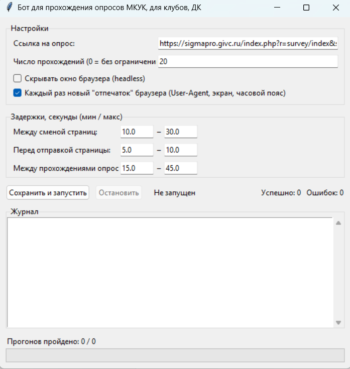
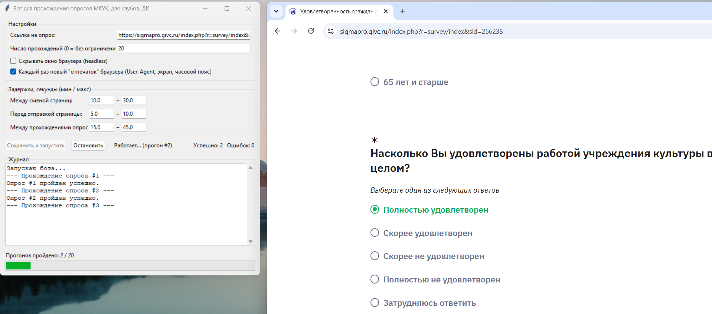

# Опрос-бот (SigmaPro / LimeSurvey)

Вы работаете Доме Культуры \ сельском клубе \ прочем культурном учреждении, и уже устали проходить даунские опросы? Вам поможет этот проект. Он проходит опрос по ссылке, выбирая хорошие варианты ответа.

Бот на Python, который самостоятельно и раз за разом проходит скучный опрос на сайте на движке SigmaPro (LimeSurvey) — со случайными паузами между действиями и «свежим» профилем браузера на каждый прогон, чтобы не выглядеть как спам-скрипт.

Управление — через простое окно (tkinter): ссылка на опрос, задержки, число прогонов, кнопки «Запустить»/«Остановить» и живой журнал происходящего.


*(скриншот здесь)*

## Что делает бот

- открывает опрос в Chromium через [Playwright](https://playwright.dev/python/) и проходит по всем его страницам, заполняя вопросы по заранее заданным правилам;
- на каждый новый прогон использует чистый профиль браузера (без cookie от прошлых запусков), со случайным User-Agent, разрешением окна и часовым поясом;
- умеет повторять прохождение нужное число раз (или бесконечно), со случайными задержками между действиями;
- всё это настраивается визуально — не нужно редактировать код или JSON руками.

## Быстрый старт (Windows)

1. Скачайте/склонируйте репозиторий.
2. Установите [Python 3.9+](https://www.python.org/downloads/) — при установке обязательно поставьте галочку **Add Python to PATH**.
3. Запустите `start.bat` двойным щелчком.
   - При первом запуске скрипт сам установит недостающие зависимости (Playwright и браузер Chromium) — это может занять пару минут.
   - Откроется окно бота.
4. В окне проверьте/поправьте настройки и нажмите **«Сохранить и запустить»**.

> На macOS/Linux двойного клика по `.bat` не будет — запустите `python launcher.py` (или сразу `python gui.py`, если зависимости уже установлены) из терминала.


*(скриншот здесь)*

## Настройки в окне бота

| Поле | Что означает |
|---|---|
| Ссылка на опрос | URL опроса. Может со временем меняться — структура вопросов, по опыту, нет. |
| Число прохождений | Сколько раз подряд пройти опрос. `0` — без ограничения, бот работает, пока не нажмёте «Остановить». |
| Headless | Скрыть окно браузера и проходить опрос в фоне, не показывая его на экране. |
| Новый «отпечаток» браузера | При каждом прогоне менять User-Agent, разрешение окна и часовой пояс. |
| Сохранять снимок при ошибке | Если прогон завершился ошибкой — сохранять скриншот и HTML страницы в папку `debug/` (см. «Диагностика проблем» ниже). Можно отключить, когда бот уже настроен и стабильно работает. |
| Задержки (мин / макс, сек) | Случайное время ожидания: между сменой страниц опроса, перед отправкой заполненной страницы, между двумя прохождениями подряд. |

Настройки сохраняются в `config.json` — его можно редактировать и вручную, без GUI.

## Как бот отвечает на вопросы

Правила ответов зашиты в `bot/rules.py` под конкретную структуру этого опроса: для одних вопросов задан фиксированный ответ, для других (пол, возраст) — случайный выбор среди вариантов, для табличного вопроса — фиксированная оценка «5» в каждой строке, кроме последней, где ответ случайный между «5» и «Затрудняюсь ответить».

Если понадобится приспособить бота под другой опрос или изменившуюся вёрстку — нужно поправить селекторы в `bot/survey_bot.py` и правила в `bot/rules.py`.

## Структура проекта

```
├── start.bat          # точка входа для Windows — двойной клик запускает всё
├── launcher.py         # проверяет Python, ставит зависимости, открывает GUI
├── gui.py                # окно настроек/запуска/журнала (tkinter)
├── config.json            # настройки бота (можно редактировать вручную)
├── requirements.txt         # Python-зависимости (Playwright)
├── bot/
│   ├── survey_bot.py          # основной цикл прохождения опроса (Playwright)
│   ├── rules.py                 # правила ответов на конкретные вопросы
│   └── profile.py                # рандомизация «отпечатка» браузера
└── debug/                      # сюда бот сохраняет скриншот+HTML при ошибке (создаётся автоматически)
```

`pages/` и `debug/` не входят в репозиторий (см. `.gitignore`) — это только локальные рабочие файлы: сохранённые HTML-снимки страниц опроса, использованные при разработке, и отладочные снимки при ошибках.

## Диагностика проблем

- **Бот не находит кнопку «Продолжить» / зависает на странице.** Сайт мог показать неожиданную промежуточную страницу (например, подтверждение организации). Проверьте папку `debug/` — туда бот при ошибке сохраняет скриншот и HTML страницы, на которой застрял; по ним будет видно, что не так.
- **Playwright не может установить Chromium.** Для первого запуска нужен доступ в интернет — браузер скачивается один раз.
- **Окно бота не открывается, ошибка про tkinter.** Переустановите Python стандартным установщиком с python.org — модуль tkinter входит в него по умолчанию.

## Ответственное использование

Бот создан для автоматизации личного, рутинного прохождения одного и того же опроса на нескольких устройствах. Используйте его в соответствии с условиями конкретного сайта и на свой страх и риск.
